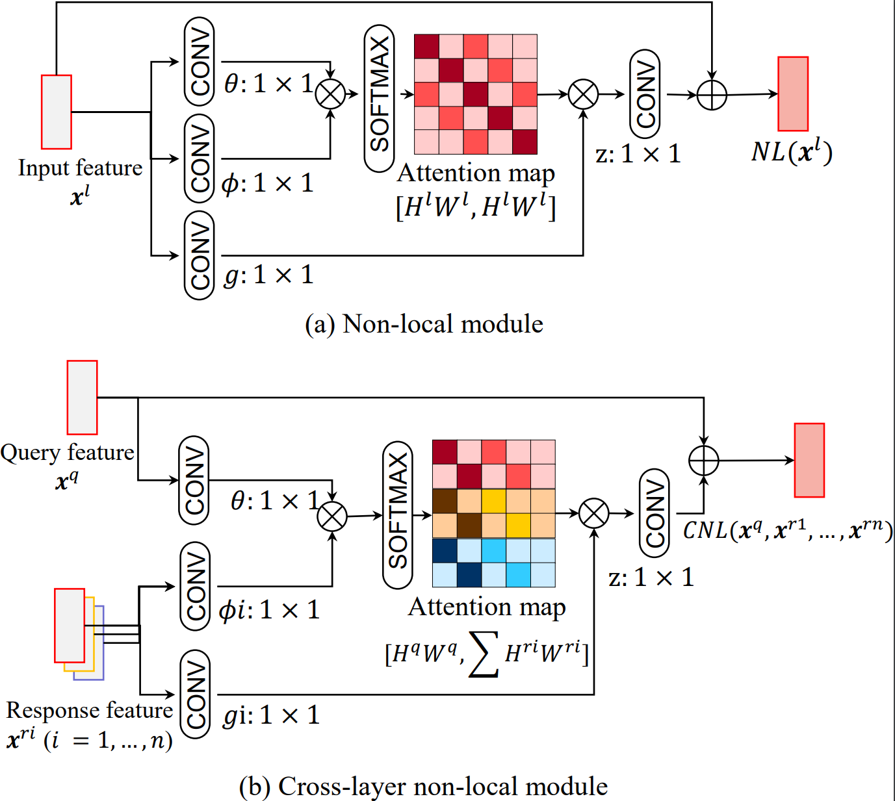

# Associating Multi-Scale Receptive Fields for Fine-grained Recognition

By Zihan Ye (zihhye@outlook.com), Fuyuan Hu, Yin Liu (echoooooliu1998@gmail.com), Zhenping Xia, Fan Lyu (fanlyu@tju.edu.cn) and Pengqing Liu

## Introduction

This is a [PyTorch](https://pytorch.org/) implementation for the paper "Associating Multi-Scale Receptive Fields for Fine-grained Recognition" in ICIP2020. It brings the CNL models trained on the [CUB-200](http://www.vision.caltech.edu/visipedia/CUB-200.html), [Stanford-Dogs](http://vision.stanford.edu/aditya86/ImageNetDogs/main.html) and [Stanford-Cars](http://ai.stanford.edu/~jkrause/cars/car_dataset.html).



## Citation

If you think this code is useful in your research or wish to refer to the baseline results published in our paper, please use the following BibTeX entry.

```
@article{Associating2020Zihan,
    author={Zihan Ye and Fuyuan Hu and Yin Liu and Zhenping Xia and Fan Lyu and Pengqing Liu},
    title={Associating Multi-Scale Receptive Fields for Fine-grained Recognition},
    journal={ICIP},
    year={2020}
}
```

## Requirements

  * PyTorch >= 0.4.1 or 1.0 from a nightly release
  * Python >= 3.5
  * torchvision >= 0.2.1
  * termcolor >= 1.1.0

## Environment

The code is developed and tested under 8 Tesla P40 / V100-SXM2-16GB GPUS cards on CentOS with installed CUDA-9.2/8.0 and cuDNN-7.1.

## Baselines and Main Results on CUB-200 Dataset

| Model                | Best Top-1 (%) | Top-5 (%) |
|:-------------------- |:--------------:|:---------:|
| R-50                 | 84.05          | 96.00     |
| R-50     w/ 5NL      | 85.10          | 96.18     |
| R-50     w/ 5CNL     | 85.64          | 96.84     |
| R-101                | 85.05          | 96.70     |
| R-101    w/ 5NL      | 85.53          | 96.65     |
| R-101    w/ 5CNL     | 86.73          | 96.75     |

### Notes:
  - The input size is 448.
  - Prolonging the `WARMUP_ITERS` appropriately would produce the better results for CNLNet models.

## Getting Start

### Prepare Dataset

  - Download pytorch imagenet pretrained models from [pytorch model zoo](https://pytorch.org/docs/stable/model_zoo.html#module-torch.utils.model_zoo). The optional download links can be found in [torchvision](https://github.com/pytorch/vision/tree/master/torchvision/models). Put them in the `pretrained` folder.

  - Download the training and validation lists for CUB-200 dataset from [Baidu Pan](https://pan.baidu.com/s/1BLfIyav1LNWaGpCragHc6w)(Password:b8r6).
  - Download the training and validation lists for Stanford_Car dataset from [Baidu Pan](https://pan.baidu.com/s/15YSPCPfPsXnSEd3wT5lfVg)(Password:lrtz).
  - Download the training and validation lists for Stanford_Dog dataset from [Baidu Pan](https://pan.baidu.com/s/1wSHpo-igMsVTDsdW6itPRw)(Password:ih96).
  Put them in the `data` folder and make them look like:

    ```
    ${THIS REPO ROOT}
     `-- pretrained
         |-- resnet50-19c8e357.pth
         |-- resnet101-5d3b4d8f.pth
     `-- data
         `-- cub
             `-- images
             |   |-- 001.Black_footed_Albatross
             |   |-- 002.Laysan_Albatross
             |   |-- ...
             |   |-- 200.Common_Yellowthroat
             |-- cub_train.list
             |-- cub_val.list
             |-- images.txt
             |-- image_class_labels.txt
             |-- README
         `-- Stanford_Car
             `-- images
             |-- cars_train.list
             |-- cars_test.list
             |-- ...
         `-- Stanford_Dog
             `-- Images
             |-- dogs_train.list
             |-- dogs_test.list
             |-- ...
    ```

### Perform Validating

```bash
$ python train_val.py --arch '50' --dataset 'cub' --checkpoints ${FOLDER_DIR} --valid
```

### Perform Training ResNet with Cross-layer Non-Local module

```bash
$ python train_val.py --arch '50' --dataset 'cub' --warmup
```

## License

This code is released under the MIT License. See [LICENSE](LICENSE) for additional details.
